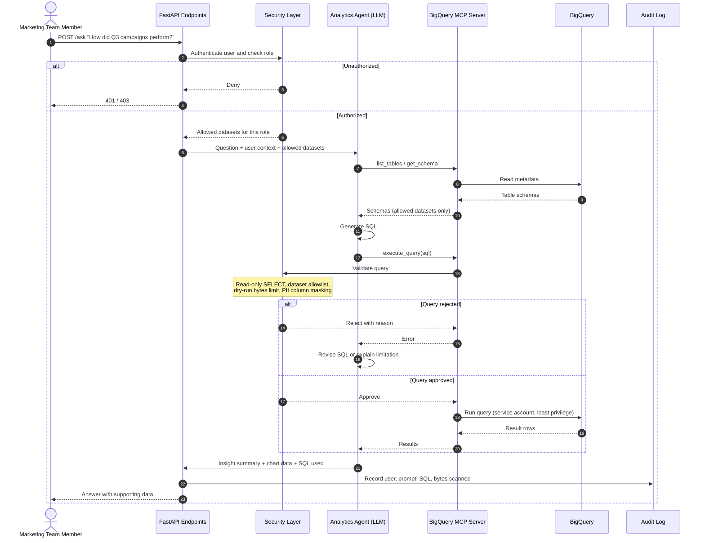
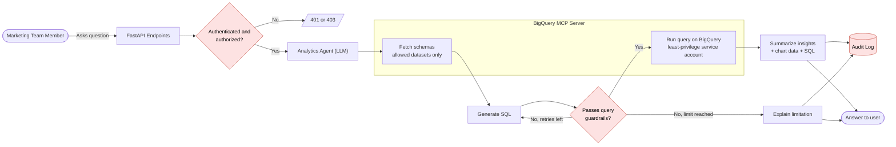

Marketing Analytics Agent on BigQuery MCP, with Measured Security

workflow diagram

```mermaid
%% Workflow Diagram
sequenceDiagram
    autonumber
    actor U as Marketing Team Member
    participant API as FastAPI Endpoints
    participant SEC as Security Layer
    participant AG as Analytics Agent (LLM)
    participant MCP as BigQuery MCP Server
    participant BQ as BigQuery
    participant LOG as Audit Log

    U->>API: POST /ask "How did Q3 campaigns perform?"
    API->>SEC: Authenticate user and check role
    alt Unauthorized
        SEC-->>API: Deny
        API-->>U: 401 / 403
    else Authorized
        SEC-->>API: Allowed datasets for this role
        API->>AG: Question + user context + allowed datasets
        AG->>MCP: list_tables / get_schema
        MCP->>BQ: Read metadata
        BQ-->>MCP: Table schemas
        MCP-->>AG: Schemas (allowed datasets only)
        AG->>AG: Generate SQL
        AG->>MCP: execute_query(sql)
        MCP->>SEC: Validate query
        Note over SEC: Read-only SELECT, dataset allowlist,<br/>dry-run bytes limit, PII column masking
        alt Query rejected
            SEC-->>MCP: Reject with reason
            MCP-->>AG: Error
            AG->>AG: Revise SQL or explain limitation
        else Query approved
            SEC-->>MCP: Approve
            MCP->>BQ: Run query (service account, least privilege)
            BQ-->>MCP: Result rows
            MCP-->>AG: Results
        end
        AG-->>API: Insight summary + chart data + SQL used
        API->>LOG: Record user, prompt, SQL, bytes scanned
        API-->>U: Answer with supporting data
    end

``` 

```mermaid
graph LR
    U([Marketing Team Member]) -->|Asks question| API[FastAPI Endpoints]
    API --> AUTH{Authenticated and<br/>authorized?}
    AUTH -->|No| DENY[/401 or 403/]
    AUTH -->|Yes| AG["Analytics Agent (LLM)"]
    AG --> SCHEMA[Fetch schemas<br/>allowed datasets only]
    SCHEMA --> SQL[Generate SQL]
    SQL --> GUARD{Passes query<br/>guardrails?}
    GUARD -->|No, retries left| SQL
    GUARD -->|No, limit reached| EXPLAIN[Explain limitation]
    GUARD -->|Yes| RUN[Run query on BigQuery<br/>least-privilege service account]
    RUN --> SUM[Summarize insights<br/>+ chart data + SQL]
    SUM --> LOG[(Audit Log)]
    EXPLAIN --> LOG
    SUM --> ANS([Answer to user])
    EXPLAIN --> ANS

    subgraph MCP [BigQuery MCP Server]
        SCHEMA
        RUN
    end

    classDef security fill:#fde2e2,stroke:#c0392b,color:#000
    class AUTH,GUARD,LOG security
```