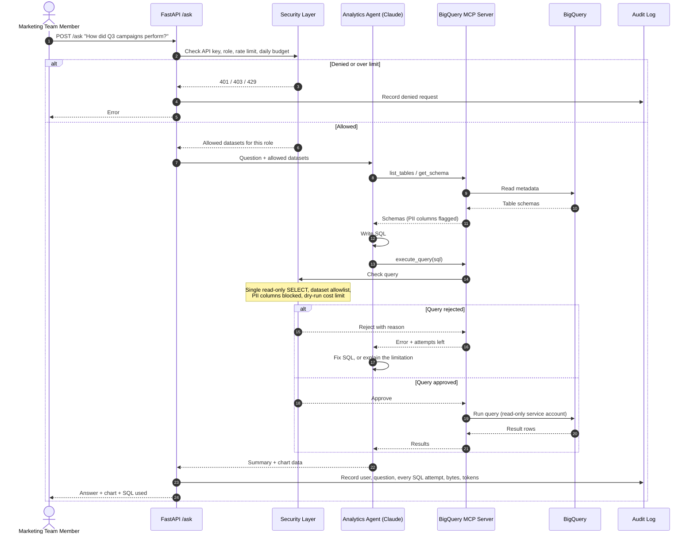
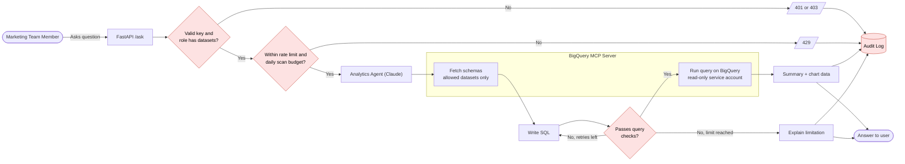

# Marketing Analytics Agent

Ask marketing questions in plain English and get answers from your BigQuery data. A
Claude agent writes and runs the SQL through an MCP server, and every query passes
security checks before it runs.

```
POST /ask  {"question": "Which channel drove the most revenue, and what was ROAS by channel?"}

→ "Video drove the most revenue at $89,057 from 432 conversions, followed by email
   ($83,293) and search ($81,789)… every channel is currently returning less than $1
   of attributed revenue per $1 spent."
   + bar chart data + the SQL that produced it
```

## Contents

- [How it works](#how-it-works)
- [Security model](#security-model)
- [Quick start](#quick-start)
- [Using the API](#using-the-api)
- [Configuration](#configuration)
- [Testing](#testing)
- [Google Cloud setup](#google-cloud-setup)
- [Docker](#docker)
- [Project layout](#project-layout)
- [Status and roadmap](#status-and-roadmap)
- [Known limitations](#known-limitations)

## How it works

1. A team member sends a question to `POST /ask` with their API key.
2. The API checks the key, the per-user rate limit and the daily scan budget. The
   user's **role** decides which BigQuery datasets are available.
3. The API builds an MCP server for that request, limited to those datasets, and
   hands the question to the Claude agent.
4. The agent explores schemas with `list_tables` / `get_schema`, writes SQL, and runs
   it with `execute_query`. Every query is checked (read-only, allowed datasets, no PII,
   cost limit) before BigQuery sees it. Rejected queries come back with a reason so
   the agent can fix them, up to a retry limit.
5. The agent returns a short summary and optional chart data. The API returns that
   with the SQL that ran, and writes an audit record.

### Request sequence



### Decision flow



## Security model

The agent is treated as untrusted: it can only ask, and the code decides. Each layer
is enforced in code and covered by tests.

| Layer | What it enforces | Where |
|---|---|---|
| **API keys** | Keys are stored only as SHA-256 digests and compared in constant time. Missing or unknown key → 401. | `app/auth.py` |
| **Roles** | Each role maps to a list of datasets. A role with none → 403. The dataset list is fixed when the MCP server is built and can't be changed through the request or tool arguments. | `app/auth.py`, `app/api.py` |
| **Query checks** | Exactly one `SELECT` (CTEs and `UNION` allowed); no DDL, DML or scripting; every table qualified and inside an allowed dataset in this project; no table functions such as `EXTERNAL_QUERY`; unparseable SQL rejected. | `app/guardrails.py` |
| **PII** | Listed columns are blocked, including through CTEs, `SELECT *`, `t.*`, and selecting a whole row by table alias. `COUNT(*)` is allowed. Schemas flag PII columns so the agent avoids them. | `app/guardrails.py`, `app/bigquery_tools.py` |
| **Cost** | A BigQuery dry run must estimate under the byte limit before the real job runs; the job also sets `maximum_bytes_billed`. Each user has a daily scan budget, and a single query can't exceed what is left. | `app/guardrails.py`, `app/limits.py` |
| **Least privilege** | The service account can read the allowed datasets and run jobs, nothing else. Even a query that got past the checks couldn't write. | [Google Cloud setup](#google-cloud-setup) |
| **Agent limits** | 3 rejected queries per question, then the agent must explain; 12 turns max; 180 s timeout; 10 questions per user per minute. | `app/agent.py`, `app/api.py` |
| **Prompt injection** | The system prompt tells Claude that tool results are data, not instructions. The checks above hold even if the model is manipulated. | `app/agent.py` |
| **Audit** | Every `/ask` request is logged, including denied and failed ones: user, role, question, each SQL attempt and its outcome, bytes, tokens, duration. Never logged: API keys (denied requests keep an 8-character hash prefix) and answer text. | `app/audit.py` |

## Quick start

Requires Python 3.13 and a Google Cloud project with BigQuery.

```bash
# 1. Install
python3.13 -m venv .venv
.venv/bin/pip install -r requirements-dev.txt

# 2. Configure
cp .env.example .env              # then edit .env (see Configuration)
gcloud auth application-default login

# 3. Create an API key for a user
.venv/bin/python scripts/hash_key.py
#   API key (give to the user): <key>
#   Digest (put in API_KEYS):   <sha256 digest>

# 4. Run
.venv/bin/uvicorn main:app --reload
```

Open http://127.0.0.1:8000/docs for interactive API docs. Click **Authorize** and paste
an API key to try the endpoints.

Minimal `.env`:

```bash
GCP_PROJECT=my-gcp-project
ANTHROPIC_API_KEY=sk-ant-...
API_KEYS={"<sha256-digest>": {"user": "ana", "role": "analyst"}}
ROLE_DATASETS={"analyst": ["marketing"], "admin": ["marketing", "customers"]}
PII_COLUMNS=["customers.customers.email", "customers.customers.phone"]
```

No data yet? [Seed the sandbox datasets](#sandbox-data).

## Using the API

### `POST /ask`

```bash
curl -X POST http://127.0.0.1:8000/ask \
  -H "Content-Type: application/json" \
  -H "X-API-Key: $API_KEY" \
  -d '{"question": "What were total spend and clicks by channel, and which had the lowest cost per click?"}'
```

```json
{
  "request_id": "b3560757-dc96-4a78-9c82-d0a18bee9c8a",
  "status": "answered",
  "summary": "Across Apr 2 – Sep 12, 2026, total spend was $680,294.52 for 481,403 clicks. … Display had the lowest cost per click at $1.32, while video was the most expensive at $1.48.",
  "chart": {
    "type": "bar",
    "title": "Cost per click by channel (Apr–Sep 2026)",
    "x_label": "Channel",
    "y_label": "Cost per click (USD)",
    "points": [{"label": "display", "value": 1.32}, {"label": "search", "value": 1.39}]
  },
  "sql_used": ["SELECT c.channel, SUM(s.spend) AS spend, … GROUP BY c.channel ORDER BY cpc"],
  "bytes_processed": 28196
}
```

- `status` is `answered`, or `limitation` when the data or the security rules didn't
  allow a full answer. The summary then explains why, for example "phone numbers are
  restricted PII".
- `chart` is `null` when a chart wouldn't help.
- `sql_used` lists only queries that ran. Rejected attempts are in the audit log.
- `question` must be 3–2000 characters.

| Status | Meaning |
|---|---|
| 200 | Answered, or a limitation explained in `summary` |
| 401 | Missing or unknown API key |
| 403 | The key's role has no datasets |
| 422 | Invalid request body |
| 429 | Rate limit (see `Retry-After`) or daily scan budget reached |
| 502 | The Anthropic API is unavailable |
| 504 | The question took longer than `ASK_TIMEOUT_SECONDS` |
| 500 | Anything else (details only in the audit log) |

### Other endpoints

- `GET /health`: liveness check, no auth.
- `GET /whoami`: shows the user, role and datasets for an API key.

### Command line

Ask the agent directly, without the API (uses `MCP_ALLOWED_DATASETS`):

```bash
MCP_ALLOWED_DATASETS='["marketing"]' .venv/bin/python -m app.agent "How many campaigns do we have?"
```

Run the MCP server on its own, for example with MCP Inspector:

```bash
MCP_ALLOWED_DATASETS='["marketing"]' .venv/bin/python -m app.mcp_server
```

## Configuration

All settings come from environment variables or `.env` (see `.env.example`). JSON
values must be valid JSON.

| Variable | Default | Description |
|---|---|---|
| `GCP_PROJECT` | `my-gcp-project` | Project that holds the datasets. Queries outside it are rejected. |
| `API_KEYS` | `{}` | `{"<sha256 of key>": {"user": ..., "role": ...}}`. Generate with `scripts/hash_key.py`. |
| `ROLE_DATASETS` | `{}` | `{"<role>": ["dataset", ...]}` |
| `PII_COLUMNS` | `[]` | `["dataset.table.column", ...]` columns that can never be queried |
| `ANTHROPIC_API_KEY` | – | Claude API key. Keep it only in `.env` or a secret manager. |
| `AGENT_MODEL` | `claude-opus-5` | Claude model for the agent |
| `AGENT_EFFORT` | `high` | `low` / `medium` / `high` / `xhigh` / `max`. Lower is faster and cheaper. |
| `AGENT_MAX_QUERY_RETRIES` | `3` | Rejected queries allowed before the agent must explain instead |
| `AGENT_MAX_TURNS` | `12` | Max model turns per question |
| `MAX_BYTES_BILLED` | `1073741824` (1 GiB) | Max bytes a single query may scan |
| `MAX_RESULT_ROWS` | `500` | Rows returned to the agent per query |
| `QUERY_TIMEOUT_SECONDS` | `60` | BigQuery query timeout |
| `ASK_RATE_LIMIT_PER_MINUTE` | `10` | Questions per user per rolling minute |
| `USER_DAILY_BYTES_LIMIT` | `10737418240` (10 GiB) | BigQuery bytes per user per UTC day |
| `ASK_TIMEOUT_SECONDS` | `180` | `/ask` timeout |
| `AUDIT_LOG_PATH` | `logs/audit.jsonl` | Audit log file, or `-` for stdout (the Docker image sets `-`) |
| `MCP_ALLOWED_DATASETS` | `[]` | Datasets for the command-line agent and standalone MCP server only |

## Testing

```bash
.venv/bin/python -m pytest -q
```

Use `python -m pytest`, not bare `pytest`: it puts the project root on the import path.

| Suite | Needs | Covers |
|---|---|---|
| Unit (default) | nothing | Auth, query checks (attack and normal queries), MCP server via an in-process client, agent loop with a scripted fake Claude, `/ask` with the audit log, limits |
| Integration | `BQ_INTEGRATION_PROJECT` + GCP credentials + [sandbox data](#sandbox-data) | Real BigQuery: schemas, PII flags, results checked against the seed data, real dry-run cost limits, MCP end to end |
| Live agent | the above + `ANTHROPIC_API_KEY` | Real Claude + BigQuery: known answers, and a request for PII that must not leak. Costs a few cents. |

Integration and live tests skip themselves when their variables are missing:

```bash
BQ_INTEGRATION_PROJECT=my-gcp-project .venv/bin/python -m pytest tests/test_integration_bigquery.py
set -a; . ./.env; set +a
BQ_INTEGRATION_PROJECT=my-gcp-project .venv/bin/python -m pytest tests/test_agent_live.py -v
```

CI (`.github/workflows/ci.yml`) runs the unit tests and a Docker build on every pull
request and push to `main`.

## Google Cloud setup

### Least-privilege service account

The app should run as a service account that can only read the allowed datasets and
run query jobs:

```bash
PROJECT=my-gcp-project
SA=mkt-analytics-agent@$PROJECT.iam.gserviceaccount.com

gcloud iam service-accounts create mkt-analytics-agent --project=$PROJECT \
  --display-name="Marketing Analytics Agent"

# Run query jobs (no data access by itself)
gcloud projects add-iam-policy-binding $PROJECT \
  --member="serviceAccount:$SA" --role="roles/bigquery.jobUser" --condition=None
```

Grant read access on **each allowed dataset** (not the whole project), so datasets
added later stay private. `bq add-iam-policy-binding` on datasets needs allowlisting
in some projects; the dataset access list works everywhere:

```bash
.venv/bin/python - <<EOF
from google.cloud import bigquery
c = bigquery.Client(project="$PROJECT")
for name in ["marketing", "customers"]:
    ds = c.get_dataset(name)
    ds.access_entries = [*ds.access_entries,
        bigquery.AccessEntry(role="READER", entity_type="userByEmail", entity_id="$SA")]
    c.update_dataset(ds, ["access_entries"])
EOF
```

For local development, act as the service account instead of your own (usually much
broader) account:

```bash
gcloud iam service-accounts add-iam-policy-binding $SA \
  --member="user:you@example.com" --role="roles/iam.serviceAccountTokenCreator"
gcloud auth application-default login --impersonate-service-account=$SA
```

New IAM grants can take a few minutes to take effect.

### Sandbox data

`scripts/seed_sandbox.py` creates two datasets with deterministic fake data, using free
load jobs (works without billing):

| Table | Rows |
|---|---|
| `marketing.campaigns` | 20 |
| `marketing.ad_spend_daily` | ~700 |
| `marketing.conversions` | 2,000 |
| `customers.customers` | 500 (fake names, emails and phones, to exercise the PII checks) |

```bash
.venv/bin/python scripts/seed_sandbox.py my-gcp-project
```

Seeding writes data, so run it with your own credentials, not the read-only service
account.

## Docker

```bash
docker build -t mkt-analytics-agent .
docker run -p 8080:8080 --env-file .env \
  -e GOOGLE_APPLICATION_CREDENTIALS=/gcloud/application_default_credentials.json \
  -v "$HOME/.config/gcloud:/gcloud:ro" \
  mkt-analytics-agent
```

The image runs as a non-root user, listens on `$PORT` (default 8080) and writes audit
records to stdout, where Cloud Run sends them to Cloud Logging. On Cloud Run, attach
the service account to the service instead of mounting credentials.

## Project layout

```
app/
  api.py             FastAPI app: /ask, /whoami, /health; limits, timeout, audit
  agent.py           Claude agent loop, structured answer, retry and turn limits
  mcp_server.py      MCP server exposing list_tables, get_schema, execute_query
  bigquery_tools.py  BigQuery calls behind the MCP tools; checks on every query
  guardrails.py      SQL checks: read-only, dataset allowlist, PII, cost
  auth.py            API-key auth and roles
  limits.py          Per-user rate limit and daily scan budget
  audit.py           JSON-lines audit log
  config.py          Settings from environment / .env
scripts/
  hash_key.py        Generate an API key and its digest
  seed_sandbox.py    Create sandbox datasets with fake data
tests/               Unit tests, plus integration and live tests that skip by default
main.py              Entry point for `uvicorn main:app`
Dockerfile           Production image
```

## Status and roadmap

| Phase | Status |
|---|---|
| 0. Project setup | ✅ Done |
| 1. API-key auth and roles | ✅ Done |
| 2. Query checks | ✅ Done |
| 3. BigQuery MCP server | ✅ Done, tested against real BigQuery |
| 4. Claude analytics agent | ✅ Done, tested live |
| 5. `/ask` endpoint and audit log | ✅ Done |
| 6a. Rate limits, daily budget, timeouts, Docker, CI | ✅ Done |
| 6b. Secret Manager, Cloud Run deployment, Workload Identity Federation for CI | Planned |

Each feature was built on its own branch, each based on the previous one:
`docs/workflow-diagrams` → `feature/project-setup` → `feature/api-key-auth` →
`feature/query-guardrails` → `feature/bigquery-mcp-server` → `feature/analytics-agent`
→ `feature/ask-endpoint` → `feature/hardening`.

## Known limitations

- **Limits are per server instance.** The rate limit and daily scan budget are kept
  in memory and reset on restart. With several Cloud Run instances each keeps its own
  count. Use a shared store (Redis, Firestore) for hard limits across instances.
- **PII checks are strict.** Any reference to a PII column is rejected, even
  `COUNTIF(phone IS NOT NULL)` or `SELECT * EXCEPT(email)`. A column in another table
  with the same name as a PII column is also blocked when both tables are in the query.
- **Latency and cost.** A question takes about 15–30 s and roughly 3–5¢ with
  `claude-opus-5` at effort `high`. Lower `AGENT_EFFORT` for faster, cheaper answers.
- **API keys are managed by hand** in `API_KEYS`. Single sign-on (for example
  Identity-Aware Proxy in front of Cloud Run) is a later option.
- **Answers are only as good as the data.** Numbers come from query results, but the
  agent can still pick a reasonable-looking query that doesn't match what you meant.
  Check `sql_used` for important decisions.
