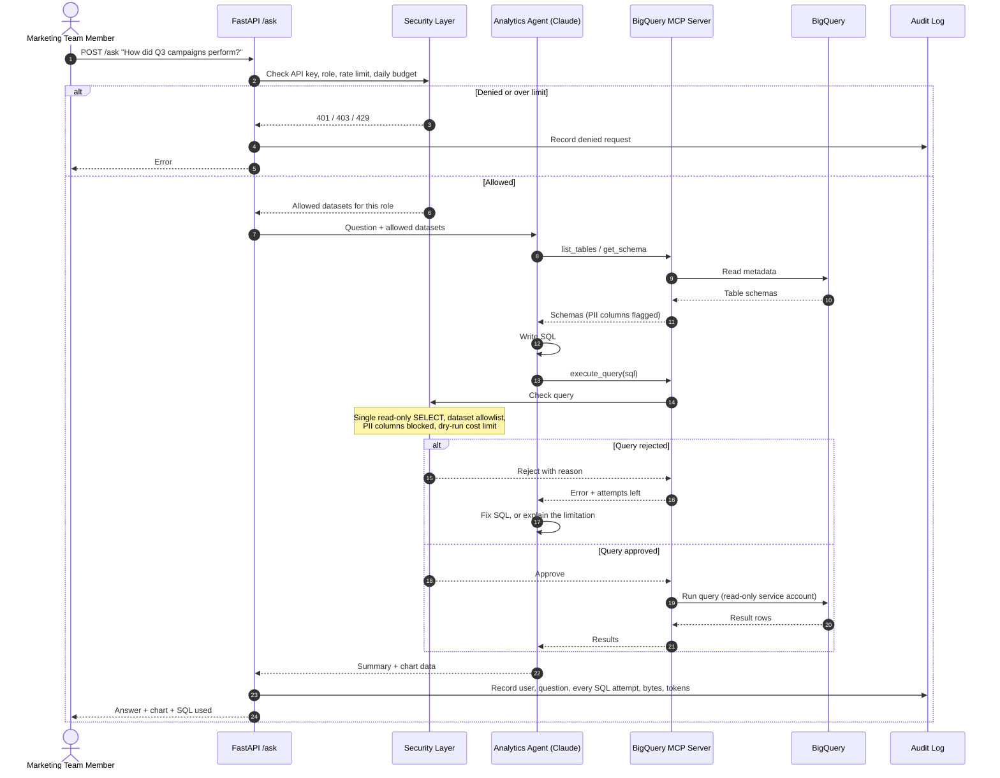
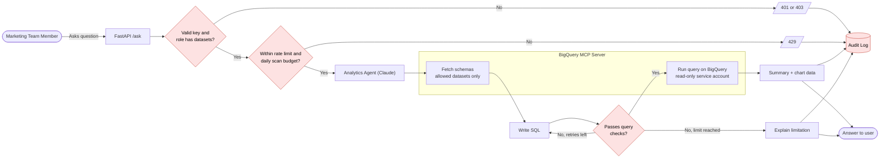

# Marketing Analytics Agent

Ask marketing questions in plain English and get answers from your BigQuery data. A
Claude agent writes and runs the SQL through an MCP server, and every query passes
security checks before it runs.

```
POST /ask  {"question": "Which channel drove the most revenue, and what was ROAS by channel?"}

→ "Video drove the most revenue at $89,057 from 432 conversions, followed by email
   ($83,293) and search ($81,789)… every channel is currently returning less than $1
   of attributed revenue per $1 spent."
   + bar chart data + the SQL that produced it
```

## Contents

- [How it works](#how-it-works)
- [Security model](#security-model)
- [Quick start](#quick-start)
- [Web app](#web-app)
- [Plans and usage](#plans-and-usage)
- [Using the API](#using-the-api)
- [Configuration](#configuration)
- [Testing](#testing)
- [Google Cloud setup](#google-cloud-setup)
- [Docker](#docker)
- [Project layout](#project-layout)
- [Status and roadmap](#status-and-roadmap)
- [Known limitations](#known-limitations)

## How it works

1. A team member signs in with Google in the [web app](#web-app) (or a script sends an
   API key) and sends a question to `POST /ask`.
2. The API checks the key, the per-user rate limit and the daily scan budget. The
   user's **role** decides which BigQuery datasets are available.
3. The API builds an MCP server for that request, limited to those datasets, and
   hands the question to the Claude agent.
4. The agent explores schemas with `list_tables` / `get_schema`, writes SQL, and runs
   it with `execute_query`. Every query is checked (read-only, allowed datasets, no PII,
   cost limit) before BigQuery sees it. Rejected queries come back with a reason so
   the agent can fix them, up to a retry limit.
5. The agent returns a short summary and optional chart data. The API returns that
   with the SQL that ran, and writes an audit record.

### Request sequence


```mermaid
sequenceDiagram
    autonumber
    actor U as Marketing Team Member
    participant API as FastAPI /ask
    participant SEC as Security Layer
    participant AG as Analytics Agent (Claude)
    participant MCP as BigQuery MCP Server
    participant BQ as BigQuery
    participant LOG as Audit Log

    U->>API: POST /ask "How did Q3 campaigns perform?"
    API->>SEC: Check API key, role, rate limit, daily budget
    alt Denied or over limit
        SEC-->>API: 401 / 403 / 429
        API->>LOG: Record denied request
        API-->>U: Error
    else Allowed
        SEC-->>API: Allowed datasets for this role
        API->>AG: Question + allowed datasets
        AG->>MCP: list_tables / get_schema
        MCP->>BQ: Read metadata
        BQ-->>MCP: Table schemas
        MCP-->>AG: Schemas (PII columns flagged)
        AG->>AG: Write SQL
        AG->>MCP: execute_query(sql)
        MCP->>SEC: Check query
        Note over SEC: Single read-only SELECT, dataset allowlist,<br/>PII columns blocked, dry-run cost limit
        alt Query rejected
            SEC-->>MCP: Reject with reason
            MCP-->>AG: Error + attempts left
            AG->>AG: Fix SQL, or explain the limitation
        else Query approved
            SEC-->>MCP: Approve
            MCP->>BQ: Run query (read-only service account)
            BQ-->>MCP: Result rows
            MCP-->>AG: Results
        end
        AG-->>API: Summary + chart data
        API->>LOG: Record user, question, every SQL attempt, bytes, tokens
        API-->>U: Answer + chart + SQL used
    end
```

### Decision flow


```mermaid
graph LR
    U([Marketing Team Member]) -->|Asks question| API[FastAPI /ask]
    API --> AUTH{Valid key and<br/>role has datasets?}
    AUTH -->|No| DENY[/401 or 403/]
    AUTH -->|Yes| LIMIT{Within rate limit and<br/>daily scan budget?}
    LIMIT -->|No| SLOW[/429/]
    LIMIT -->|Yes| AG["Analytics Agent (Claude)"]
    AG --> SCHEMA[Fetch schemas<br/>allowed datasets only]
    SCHEMA --> SQL[Write SQL]
    SQL --> GUARD{Passes query<br/>checks?}
    GUARD -->|No, retries left| SQL
    GUARD -->|No, limit reached| EXPLAIN[Explain limitation]
    GUARD -->|Yes| RUN[Run query on BigQuery<br/>read-only service account]
    RUN --> SUM[Summary + chart data]
    SUM --> ANS([Answer to user])
    EXPLAIN --> ANS
    DENY --> LOG[(Audit Log)]
    SLOW --> LOG
    SUM --> LOG
    EXPLAIN --> LOG

    subgraph MCP [BigQuery MCP Server]
        SCHEMA
        RUN
    end

    classDef security fill:#fde2e2,stroke:#c0392b,color:#000
    class AUTH,LIMIT,GUARD,LOG security
```

## Security model

The agent is treated as untrusted: it can only ask, and the code decides. Each layer
is enforced in code and covered by tests.

| Layer | What it enforces | Where |
|---|---|---|
| **Sign-in** | People sign in with Google (OpenID Connect code flow with PKCE, state and nonce; ID token signature, issuer, audience and expiry verified; verified email required). Access comes from `USER_ROLES`, checked on every request. The session is an HMAC-signed, HttpOnly, Secure, SameSite=Lax cookie that expires after 8 hours; cookie-authenticated writes also need an `X-Requested-With` header (CSRF). | `app/google_auth.py`, `app/auth.py`, `app/sessions.py` |
| **API keys** | For scripts and integrations. Stored only as SHA-256 digests and compared in constant time. Missing or unknown key → 401. | `app/auth.py` |
| **Roles** | Each role maps to a list of datasets. A role with none → 403. The dataset list is fixed when the MCP server is built and can't be changed through the request or tool arguments. | `app/auth.py`, `app/api.py` |
| **Query checks** | Exactly one `SELECT` (CTEs and `UNION` allowed); no DDL, DML or scripting; every table qualified and inside an allowed dataset in this project; no table functions such as `EXTERNAL_QUERY`; unparseable SQL rejected. | `app/guardrails.py` |
| **PII** | Listed columns are blocked, including through CTEs, `SELECT *`, `t.*`, and selecting a whole row by table alias. `COUNT(*)` is allowed. Schemas flag PII columns so the agent avoids them. | `app/guardrails.py`, `app/bigquery_tools.py` |
| **Cost** | A BigQuery dry run must estimate under the byte limit before the real job runs; the job also sets `maximum_bytes_billed`. Each user has a daily scan budget, and a single query can't exceed what is left. | `app/guardrails.py`, `app/limits.py` |
| **Least privilege** | The service account can read the allowed datasets and run jobs, nothing else. Even a query that got past the checks couldn't write. | [Google Cloud setup](#google-cloud-setup) |
| **Agent limits** | 3 rejected queries per question, then the agent must explain; 12 turns max; 180 s timeout; 10 questions per user per minute. | `app/agent.py`, `app/api.py` |
| **Misuse and distillation** | The Claude key never leaves the server and is never in the conversation, so the model can't reveal it. People can only send a question (the model, prompt, tools and limits are fixed). The assistant only answers questions about the data and declines anything else, including requests for its instructions or reasoning (`declined`). Per question: a model-visible task budget (40k tokens) and a hard 150k-token cap. Per person: one question at a time, 200 questions a day on every plan, and a pause until midnight UTC after 10 declined requests. Sign-in links to acceptable-use terms that forbid bulk harvesting and training models on answers. | `app/agent.py`, `app/api.py`, `app/static/terms.html` |
| **Prompt injection** | The system prompt tells Claude that tool results are data, not instructions. The checks above hold even if the model is manipulated. | `app/agent.py` |
| **Audit** | Every `/ask` request is logged, including denied and failed ones: user, role, question, each SQL attempt and its outcome, bytes, tokens, duration. Every Google sign-in is logged too (`signed_in`, `access_requested`, or `denied` with the reason). Never logged: API keys (denied requests keep an 8-character hash prefix), tokens, cookies and answer text. | `app/audit.py` |

## Quick start

Requires Python 3.13 and a Google Cloud project with BigQuery.

```bash
# 1. Install
python3.13 -m venv .venv
.venv/bin/pip install -r requirements-dev.txt

# 2. Configure
cp .env.example .env              # then edit .env (see Configuration)
gcloud auth application-default login

# 3. Create an API key for a user
.venv/bin/python scripts/hash_key.py
#   API key (give to the user): <key>
#   Digest (put in API_KEYS):   <sha256 digest>

# 4. Run
.venv/bin/uvicorn main:app --reload
```

Open http://127.0.0.1:8000 for the [web app](#web-app), or
http://127.0.0.1:8000/docs for interactive API docs. Click **Authorize** and paste
an API key to try the endpoints.

Minimal `.env`:

```bash
GCP_PROJECT=my-gcp-project
ANTHROPIC_API_KEY=sk-ant-...
API_KEYS={"<sha256-digest>": {"user": "ana", "role": "analyst"}}
ROLE_DATASETS={"analyst": ["ga4", "marketing"], "admin": ["ga4", "marketing", "customers"]}
PII_COLUMNS=["customers.customers.email", "customers.customers.phone"]
```

No data yet? [Build the GA4 dataset](#ga4-data-public-sample) (real, anonymised web
analytics) and/or [seed the sandbox datasets](#sandbox-data).

## Web app

For people who don't use the command line, the API serves a browser app at `/`. Give
people the site's address; nothing needs installing, and nobody handles a key or
password for this app.

1. **Sign in** with *Continue with Google*, using their work Google account. The app
   receives only their name and verified email address. Anyone can sign in; people
   not yet listed in `USER_ROLES` see a *You don't have access yet* page (and an
   `access_requested` audit record tells the admin who is waiting). Once added, they
   click *I've been added, check again*. Sessions last 8 hours.
2. **Ask** in plain English, or click an example. Under *What you can ask about*, each
   dataset the person's role can use is described in plain words with example
   questions.
3. **Read the answer**: a short summary, a chart when it helps, and the numbers as a
   table. *Partly answered* means the data or the security rules didn't allow a full
   answer; the summary says why.
4. **Use it in your work**:

   | Button | Gives you |
   |---|---|
   | Copy answer | Question, summary, figures and a reference, ready to paste into email, docs or chat |
   | Download for Excel (.csv) | The chart's numbers, for Excel or Google Sheets |
   | Download chart image (.png) | A titled, high-resolution chart for slides and reports |
   | Copy link to this question | A link that opens the app with the question filled in (not run) for a colleague |

5. **Check the working** under *How was this worked out?*: the SQL that ran, how much
   data it read, and a reference ID that matches the audit log.

Recent questions and their answers stay in the sidebar, stored only in that browser
(same lifetime as the key). Errors are explained in plain words, for example the
per-minute limit with a wait time, the daily data allowance, or a timeout with a hint
to narrow the question.

The look is a calm, product-style design: the Inter typeface, a neutral palette with
one blue accent, hairline borders, rounded inputs with focus rings and custom
checkboxes, with light and dark themes. Text and controls meet WCAG AA contrast
(4.5:1 for text, 3:1 for input borders), errors appear under the field they belong
to, and focus is always visible. Charts use [Apache ECharts](https://echarts.apache.org/)
with hover tooltips, and follow fixed specs: one validated series colour per theme
(checked for contrast and colour-blind safety), thin bars with rounded ends, value
labels at the bar tips, and the latest value labelled on line charts.

The app is plain HTML, CSS and JavaScript in `app/static/`, with no build step and
nothing loaded from other sites. ECharts 6.1.0 (Apache-2.0) and the
Inter variable font 5.3.0 (SIL OFL 1.1) are bundled in `app/static/vendor/`, each
checked against its npm integrity hash (see their `VERSION` files) and served
gzip-compressed. It only calls `/whoami` and `/ask`, so every API
protection still applies. The page and its files are sent with a strict
Content-Security-Policy (same-origin scripts, styles and connections; no framing),
and server text is always inserted as text, never as HTML. Chart tooltips are drawn
on the canvas (`renderMode: "richText"`) rather than as HTML. Downloaded CSV cells
that start with `=`, `+`, `-` or `@` are prefixed with `'` so spreadsheets don't run
them as formulas.

## Plans and usage

Every question runs on the server's own Claude API key, so each one is metered:
Claude tokens and BigQuery bytes are priced at list prices (`PRICE_*` settings) and
stored with the person, plan, IP address and question in a SQLite database
(`USAGE_DB_PATH`). Each person is on one of three plans:

| Plan | Who | What they pay | Limit |
|---|---|---|---|
| **Subscription** (default for enrolled people) | `USER_ROLES` / `API_KEYS`, unless `USER_PLANS` says otherwise | `SUBSCRIPTION_FEE_USD` a month | `SUBSCRIPTION_MONTHLY_ALLOWANCE_USD` of usage (at cost) a month |
| **Pay as you go** | `USER_PLANS` entry `"payg"` | Each question at cost × `PAYG_MARKUP` | `PAYG_MONTHLY_LIMIT_USD` a month (unset for none) |
| **Free trial** | Anyone who signs in with Google but isn't enrolled, when `FREEMIUM_ENABLED=true` | Nothing | Per account per day: `FREEMIUM_DAILY_QUESTIONS` and `FREEMIUM_DAILY_COST_USD`. Per IP address per day, across all trial accounts: `FREEMIUM_IP_DAILY_QUESTIONS`. Ends `FREEMIUM_TRIAL_DAYS` after the first question. |

```bash
USER_PLANS={"ana@company.com": "payg", "@partner.com": "payg"}
FREEMIUM_ENABLED=true
FREEMIUM_DATASETS=["ga4"]          # trial users only see these, never company data
FREEMIUM_BLOCKED_ACCOUNTS=["@tempmail.dev"]
FREEMIUM_BLOCKED_IPS=["203.0.113.0/24"]
TRUSTED_PROXY_HOPS=1               # on Cloud Run, so the real client IP is used
```

- **Restricting trials:** `FREEMIUM_ALLOWED_ACCOUNTS` / `FREEMIUM_BLOCKED_ACCOUNTS`
  (emails or `@domain`) and `FREEMIUM_ALLOWED_IPS` / `FREEMIUM_BLOCKED_IPS` (CIDR).
  A refused person sees *You don't have access yet* with the reason.
- **Limits** are checked before a question runs. When one is used up, `/ask` returns
  `402` with a plain explanation, and nothing reaches Claude. Each plan's limit counts
  only usage made on that plan.
- **Client IP:** by default the connecting address is used and `X-Forwarded-For` is
  ignored, because clients can forge it. Behind a proxy, set `TRUSTED_PROXY_HOPS` to
  the number of proxies that append to the header.
- **Changing plans** (Usage page, or the API): enrolled people choose their own plan,
  which overrides `USER_PLANS` / `DEFAULT_PLAN`:

  | Action | Effect | API |
  |---|---|---|
  | Switch Subscription ↔ Pay as you go | Starts now | `POST /plan {"plan": "payg"}` |
  | Cancel subscription | Keeps working until the end of the month, then *No plan*; can be undone until then | `POST /plan/cancel`, `POST /plan/resume` |
  | Stop pay as you go | *No plan* at once | `POST /plan/cancel` |
  | Choose a plan again | Starts now | `POST /plan` |

  With *No plan*, questions are refused (`402`) and the web app asks the person to
  choose one. Changes are confirmed on the page and written to the audit log
  (`plan_change`). Free-trial accounts can't choose a plan; an admin enrols them.
- **Free trial is off by default** (`FREEMIUM_ENABLED=false`): nobody gets free daily
  usage, unenrolled people see *You don't have access yet*, and anyone set to
  `"freemium"` in `USER_PLANS` gets `DEFAULT_PLAN` instead until it's switched back on.
- **Usage page** (*Usage* in the web app, `GET /usage`): the person's plan, limit
  meters with reset dates, this month's questions and cost, a daily chart, and their
  question history. Admins (`USAGE_ADMIN_ROLES`) also see everyone's usage this month
  (`GET /usage/all`).

Costs are estimates, not invoices, and no payment is taken: connect a billing
provider (for example Stripe) to charge subscriptions and pay-as-you-go amounts.

## Using the API

### `POST /ask`

```bash
curl -X POST http://127.0.0.1:8000/ask \
  -H "Content-Type: application/json" \
  -H "X-API-Key: $API_KEY" \
  -d '{"question": "What were total spend and clicks by channel, and which had the lowest cost per click?"}'
```

```json
{
  "request_id": "b3560757-dc96-4a78-9c82-d0a18bee9c8a",
  "status": "answered",
  "summary": "Across Apr 2 – Sep 12, 2026, total spend was $680,294.52 for 481,403 clicks. … Display had the lowest cost per click at $1.32, while video was the most expensive at $1.48.",
  "chart": {
    "type": "bar",
    "title": "Cost per click by channel (Apr–Sep 2026)",
    "x_label": "Channel",
    "y_label": "Cost per click (USD)",
    "points": [{"label": "display", "value": 1.32}, {"label": "search", "value": 1.39}]
  },
  "sql_used": ["SELECT c.channel, SUM(s.spend) AS spend, … GROUP BY c.channel ORDER BY cpc"],
  "bytes_processed": 28196
}
```

- `report` is `null` for lookups. For analysis requests (why, what to do, a report,
  feedback, strategies, optimisation) the agent measures the headline figure, breaks
  it down (funnel, channel, device, landing page, new vs returning…), checks its own
  conclusions (volumes, mix effects, what the data can't show), and returns
  `findings`, `drivers` (each marked `supported`, `likely` or `hypothesis`, with
  evidence or the data that would test it), `recommendations` (impact, effort and how
  to measure success) and `caveats`. The web app shows it as a report that can be
  copied or printed / saved as PDF.
- `status` is `answered`; `limitation` when the data or the security rules didn't
  allow a full answer; or `declined` when the request wasn't a question about the data
  (the assistant only answers those). The summary then explains why, for example "phone numbers are
  restricted PII".
- `chart` is `null` when a chart wouldn't help.
- `sql_used` lists only queries that ran. Rejected attempts are in the audit log.
- `question` must be 3–2000 characters.

| Status | Meaning |
|---|---|
| 200 | Answered, or a limitation explained in `summary` |
| 401 | Missing or unknown API key |
| 403 | The key's role has no datasets |
| 422 | Invalid request body |
| 402 | A plan limit is used up (trial, included usage, or spending cap); `detail` explains |
| 429 | Rate limit (see `Retry-After`), a question already running, the daily question limit, a pause after repeated declined requests, or the daily scan budget; `detail` explains |
| 502 | The Anthropic API is unavailable |
| 504 | The question took longer than `ASK_TIMEOUT_SECONDS` |
| 500 | Anything else (details only in the audit log) |

### Signing in with Google

1. In the Google Cloud console for your project, open **Google Auth Platform**:
   - **Branding**: app name and support email.
   - **Audience**: *Internal* if your organization uses Google Workspace (only your
     organization's accounts can sign in); otherwise *External*, and while the app is
     in *Testing*, add each person under **Test users**.
   - **Clients → Create client → Web application**. Add the authorized redirect
     URI: `https://<your-domain>/auth/callback` (locally,
     `http://localhost:8000/auth/callback`).
2. Put the client ID and secret in `.env`, with a session secret and the people who
   may use the app:

   ```bash
   GOOGLE_CLIENT_ID=1234-abc.apps.googleusercontent.com
   GOOGLE_CLIENT_SECRET=...
   SESSION_SECRET=$(python -c "import secrets; print(secrets.token_urlsafe(48))")
   USER_ROLES={"ana@company.com": "analyst", "@company.com": "analyst", "boss@company.com": "admin"}
   ```

   `"@company.com"` gives everyone in that Google Workspace domain a role. It matches
   Google's verified hosted-domain claim, not just the end of the address. An exact
   address takes precedence over its domain.
3. Local development over plain http: set `SESSION_COOKIE_SECURE=false` and browse to
   `http://localhost:8000` (it must match the redirect URI).

The web app loads nothing from Google: *Continue with Google* is a link to
`/auth/login`, which redirects to Google and back to `/auth/callback`. Without the
three Google settings, the sign-in page shows the access-key form instead.

API keys still work everywhere (`X-API-Key`) for scripts and integrations; in the
web app they're under *Sign in with an access key instead*.

### Other endpoints

- `GET /`: the [web app](#web-app), no auth for the page itself.
- `GET /health`: liveness check, no auth.
- `GET /whoami`: shows the user, role and datasets for an API key or signed-in session.
- `GET /usage`: the caller's plan, limits and usage this month; `GET /usage/all`:
  everyone's, for admins.
- `POST /plan`, `POST /plan/cancel`, `POST /plan/resume`: change, quit or keep a plan
  (see [Plans and usage](#plans-and-usage)).
- `GET /auth/login`, `GET /auth/callback`, `GET /auth/session`, `POST /auth/logout`:
  Google sign-in (see above).

### Command line

Ask the agent directly, without the API (uses `MCP_ALLOWED_DATASETS`):

```bash
MCP_ALLOWED_DATASETS='["marketing"]' .venv/bin/python -m app.agent "How many campaigns do we have?"
```

Run the MCP server on its own, for example with MCP Inspector:

```bash
MCP_ALLOWED_DATASETS='["marketing"]' .venv/bin/python -m app.mcp_server
```

## Configuration

All settings come from environment variables or `.env` (see `.env.example`). JSON
values must be valid JSON.

| Variable | Default | Description |
|---|---|---|
| `GCP_PROJECT` | `my-gcp-project` | Project that holds the datasets. Queries outside it are rejected. |
| `API_KEYS` | `{}` | `{"<sha256 of key>": {"user": ..., "role": ...}}`. Generate with `scripts/hash_key.py`. |
| `ROLE_DATASETS` | `{}` | `{"<role>": ["dataset", ...]}` |
| `GOOGLE_CLIENT_ID` | – | OAuth client ID for Google sign-in |
| `GOOGLE_CLIENT_SECRET` | – | OAuth client secret. Keep it only in `.env` or a secret manager. |
| `SESSION_SECRET` | – | Signs session cookies. A long random string; changing it signs everyone out. |
| `USER_ROLES` | `{}` | `{"person@company.com": "<role>", "@company.com": "<role>"}`: who may use the app after Google sign-in |
| `OAUTH_REDIRECT_URI` | derived | Set when behind a proxy or custom domain; must match the OAuth client |
| `SESSION_MAX_AGE_SECONDS` | `28800` (8 h) | How long a sign-in lasts |
| `SESSION_COOKIE_SECURE` | `true` | Send cookies over HTTPS only. `false` only for local http. |
| `USAGE_DB_PATH` | `data/usage.sqlite3` | Usage database (one row per question) |
| `USER_PLANS` | `{}` | `{"person@company.com" or "@domain" or key user: "subscription" \| "payg" \| "freemium"}` |
| `DEFAULT_PLAN` | `subscription` | Plan for enrolled people without a `USER_PLANS` entry |
| `USAGE_ADMIN_ROLES` | `["admin"]` | Roles that see everyone's usage |
| `PRICE_INPUT_PER_MTOK` / `PRICE_OUTPUT_PER_MTOK` | `5.00` / `25.00` | Claude list prices per million tokens (claude-opus-5) |
| `PRICE_CACHE_READ_PER_MTOK` / `PRICE_CACHE_WRITE_PER_MTOK` | `0.50` / `6.25` | Prompt-cache read / write prices |
| `PRICE_BIGQUERY_PER_TIB` | `6.25` | BigQuery on-demand price per TiB scanned |
| `SUBSCRIPTION_FEE_USD` / `SUBSCRIPTION_MONTHLY_ALLOWANCE_USD` | `20.00` / `25.00` | Monthly fee shown to subscribers, and usage it includes |
| `PAYG_MARKUP` / `PAYG_MONTHLY_LIMIT_USD` | `1.2` / `100.00` | Pay-as-you-go price multiplier, and monthly cap |
| `FREEMIUM_ENABLED` | `false` | Give unenrolled Google users a free trial |
| `FREEMIUM_DATASETS` | `["ga4"]` | Datasets trial users can query |
| `FREEMIUM_DAILY_QUESTIONS` / `FREEMIUM_DAILY_COST_USD` | `5` / `0.50` | Per-account daily trial caps |
| `FREEMIUM_IP_DAILY_QUESTIONS` | `15` | Daily trial questions per IP address, across accounts |
| `FREEMIUM_TRIAL_DAYS` | `14` | Trial length from the first question (unset for no end) |
| `FREEMIUM_ALLOWED_ACCOUNTS` / `FREEMIUM_BLOCKED_ACCOUNTS` | `[]` | Emails or `@domain` allowed (empty = any) / refused a trial |
| `FREEMIUM_ALLOWED_IPS` / `FREEMIUM_BLOCKED_IPS` | `[]` | CIDR ranges allowed (empty = any) / refused a trial |
| `TRUSTED_PROXY_HOPS` | `0` | Proxies that append to `X-Forwarded-For` (Cloud Run: `1`); `0` ignores the header |
| `PII_COLUMNS` | `[]` | `["dataset.table.column", ...]` columns that can never be queried |
| `ANTHROPIC_API_KEY` | – | Claude API key. Keep it only in `.env` or a secret manager. |
| `AGENT_MODEL` | `claude-opus-5` | Claude model for the agent |
| `AGENT_EFFORT` | `high` | `low` / `medium` / `high` / `xhigh` / `max`. Lower is faster and cheaper. |
| `AGENT_MAX_QUERY_RETRIES` | `3` | Rejected queries allowed before the agent must explain instead |
| `AGENT_MAX_TURNS` | `16` | Max model turns per question (reports need more than lookups) |
| `AGENT_MAX_TOKENS_PER_QUESTION` | `150000` | Hard token cap per question (input incl. cache + output); stops runaway questions |
| `AGENT_TASK_BUDGET_TOKENS` | `40000` | Model-visible token budget per question (beta; min 20,000). Unset to turn off. |
| `ASK_MAX_CONCURRENT_PER_USER` | `1` | Questions one person may have running at once |
| `ASK_DAILY_QUESTION_LIMIT` | `200` | Questions per person per UTC day, on every plan (unset for none) |
| `DECLINED_DAILY_LIMIT` | `10` | Declined (out-of-scope) requests per person per day before questions pause until midnight UTC |
| `MAX_BYTES_BILLED` | `1073741824` (1 GiB) | Max bytes a single query may scan |
| `MAX_RESULT_ROWS` | `500` | Rows returned to the agent per query |
| `QUERY_TIMEOUT_SECONDS` | `60` | BigQuery query timeout |
| `ASK_RATE_LIMIT_PER_MINUTE` | `10` | Questions per user per rolling minute |
| `USER_DAILY_BYTES_LIMIT` | `10737418240` (10 GiB) | BigQuery bytes per user per UTC day |
| `ASK_TIMEOUT_SECONDS` | `300` | `/ask` timeout |
| `AUDIT_LOG_PATH` | `logs/audit.jsonl` | Audit log file, or `-` for stdout (the Docker image sets `-`) |
| `MCP_ALLOWED_DATASETS` | `[]` | Datasets for the command-line agent and standalone MCP server only |

## Testing

```bash
.venv/bin/python -m pytest -q
```

Use `python -m pytest`, not bare `pytest`: it puts the project root on the import path.

| Suite | Needs | Covers |
|---|---|---|
| Unit (default) | nothing | Auth, query checks (attack and normal queries), MCP server via an in-process client, agent loop with a scripted fake Claude, `/ask` with the audit log, limits |
| Integration | `BQ_INTEGRATION_PROJECT` + GCP credentials + [sandbox data](#sandbox-data) and [GA4 data](#ga4-data-public-sample) | Real BigQuery: schemas, PII flags, results checked against the seed data, real dry-run cost limits, MCP end to end; GA4 tables consistent (revenue across tables, no duplicate purchases, funnel order), public tables unreachable |
| Live agent | the above + `ANTHROPIC_API_KEY` | Real Claude + BigQuery: known answers (including GA4's top channel), a ROAS question on GA4 that must be explained as not possible, and a request for PII that must not leak. Costs a few cents. |

Integration and live tests skip themselves when their variables are missing:

```bash
BQ_INTEGRATION_PROJECT=my-gcp-project .venv/bin/python -m pytest tests/test_integration_bigquery.py tests/test_integration_ga4.py
set -a; . ./.env; set +a
BQ_INTEGRATION_PROJECT=my-gcp-project .venv/bin/python -m pytest tests/test_agent_live.py -v
```

CI (`.github/workflows/ci.yml`) runs the unit tests and a Docker build on every pull
request and push to `main`.

## Google Cloud setup

### Least-privilege service account

The app should run as a service account that can only read the allowed datasets and
run query jobs:

```bash
PROJECT=my-gcp-project
SA=mkt-analytics-agent@$PROJECT.iam.gserviceaccount.com

gcloud iam service-accounts create mkt-analytics-agent --project=$PROJECT \
  --display-name="Marketing Analytics Agent"

# Run query jobs (no data access by itself)
gcloud projects add-iam-policy-binding $PROJECT \
  --member="serviceAccount:$SA" --role="roles/bigquery.jobUser" --condition=None
```

Grant read access on **each allowed dataset** (not the whole project), so datasets
added later stay private. `bq add-iam-policy-binding` on datasets needs allowlisting
in some projects; the dataset access list works everywhere:

```bash
.venv/bin/python - <<EOF
from google.cloud import bigquery
c = bigquery.Client(project="$PROJECT")
for name in ["ga4", "marketing", "customers"]:
    ds = c.get_dataset(name)
    ds.access_entries = [*ds.access_entries,
        bigquery.AccessEntry(role="READER", entity_type="userByEmail", entity_id="$SA")]
    c.update_dataset(ds, ["access_entries"])
EOF
```

For local development, act as the service account instead of your own (usually much
broader) account:

```bash
gcloud iam service-accounts add-iam-policy-binding $SA \
  --member="user:you@example.com" --role="roles/iam.serviceAccountTokenCreator"
gcloud auth application-default login --impersonate-service-account=$SA
```

New IAM grants can take a few minutes to take effect.

### GA4 data (public sample)

`scripts/build_ga4.sql` builds a `ga4` dataset from Google's public
[GA4 obfuscated e-commerce sample](https://developers.google.com/analytics/bigquery/web-ecommerce-demo-dataset)
(Google Merchandise Store, 1 Nov 2020 – 31 Jan 2021): real, anonymised web analytics.

The query checks only allow datasets in your own project, so the agent doesn't read
the public nested event tables directly. The script flattens them once into four
tables whose descriptions define the metrics and caveats (a small semantic layer):

| Table | Rows | Use for |
|---|---|---|
| `ga4.sessions` | 360,129 | Traffic, channel, device, country, landing page, engagement, funnel (viewed item → cart → checkout → purchase), conversion rate |
| `ga4.purchases` | 5,357 | Orders, revenue, average order value by date, channel, device, country |
| `ga4.purchase_items` | 15,016 | Top products and categories, units sold |
| `ga4.users` | 270,154 | New vs returning, acquisition channel, cohorts, customer value |

Details worth knowing:

- **Purchases are de-duplicated.** The sample logs some transactions twice (5,692
  purchase events, 5,357 purchases). Revenue totals $339,457 in every table.
- **Channel** is derived from source/medium: Organic Search, Paid Search, Direct,
  Referral, Affiliates, Email, Unknown. About a third of sessions are *Unknown*
  because Google obfuscated (`<Other>`, `(data deleted)`) or omitted the source.
- **No cost data**, so ROAS, CPC and CPA can't be calculated; the table descriptions
  say so, and the agent explains this instead of guessing (covered by a live test).
- Building scans about 3.6 GB of public data (well within BigQuery's free 1 TB a month)
  and takes under a minute. A typical question then reads about 3 MB.

```bash
bq query --project_id=$PROJECT --location=US --use_legacy_sql=false < scripts/build_ga4.sql
```

Run it as yourself (`bq` uses your gcloud login, not the app's read-only service
account), then give the service account read access to `ga4` as shown in
[Least-privilege service account](#least-privilege-service-account), and add `ga4` to
`ROLE_DATASETS`.

### Sandbox data

`scripts/seed_sandbox.py` creates two datasets with deterministic fake data, using free
load jobs (works without billing):

| Table | Rows |
|---|---|
| `marketing.campaigns` | 20 |
| `marketing.ad_spend_daily` | ~700 |
| `marketing.conversions` | 2,000 |
| `customers.customers` | 500 (fake names, emails and phones, to exercise the PII checks) |

```bash
.venv/bin/python scripts/seed_sandbox.py my-gcp-project
```

Seeding writes data, so run it with your own credentials, not the read-only service
account.

## Docker

```bash
docker build -t mkt-analytics-agent .
docker run -p 8080:8080 --env-file .env \
  -e GOOGLE_APPLICATION_CREDENTIALS=/gcloud/application_default_credentials.json \
  -v "$HOME/.config/gcloud:/gcloud:ro" \
  mkt-analytics-agent
```

The image runs as a non-root user, listens on `$PORT` (default 8080) and writes audit
records to stdout, where Cloud Run sends them to Cloud Logging. On Cloud Run, attach
the service account to the service instead of mounting credentials.

## Project layout

```
app/
  api.py             FastAPI app: web app at /, /ask, /whoami, /health; limits, timeout, audit
  static/            Web app (index.html, app.js, styles.css), no build step
    vendor/          Bundled Apache ECharts and Inter font, with licences and versions
  agent.py           Claude agent loop, structured answer, retry and turn limits
  mcp_server.py      MCP server exposing list_tables, get_schema, execute_query
  bigquery_tools.py  BigQuery calls behind the MCP tools; checks on every query
  guardrails.py      SQL checks: read-only, dataset allowlist, PII, cost
  auth.py            Who is calling (API key or Google session) and their role
  google_auth.py     Sign in with Google: /auth/login, /auth/callback, /auth/logout
  sessions.py        HMAC-signed, expiring cookie tokens
  usage.py           Plans, per-question metering (SQLite), limits, trial rules
  limits.py          Per-user rate limit and daily scan budget
  audit.py           JSON-lines audit log
  config.py          Settings from environment / .env
scripts/
  hash_key.py        Generate an API key and its digest
  seed_sandbox.py    Create sandbox datasets with fake data
  build_ga4.sql      Build the ga4 dataset from Google's public GA4 sample
tests/               Unit tests, plus integration and live tests that skip by default
main.py              Entry point for `uvicorn main:app`
Dockerfile           Production image
```

## Status and roadmap

| Phase | Status |
|---|---|
| 0. Project setup | ✅ Done |
| 1. API-key auth and roles | ✅ Done |
| 2. Query checks | ✅ Done |
| 3. BigQuery MCP server | ✅ Done, tested against real BigQuery |
| 4. Claude analytics agent | ✅ Done, tested live |
| 5. `/ask` endpoint and audit log | ✅ Done |
| 6a. Rate limits, daily budget, timeouts, Docker, CI | ✅ Done |
| 6a+. Web app for non-technical users | ✅ Done |
| 6a++. GA4 public data with a semantic layer; web app redesign and ECharts | ✅ Done |
| 6b. Secret Manager, Cloud Run deployment, Workload Identity Federation for CI | Planned |

Each feature was built on its own branch, each based on the previous one:
`docs/workflow-diagrams` → `feature/project-setup` → `feature/api-key-auth` →
`feature/query-guardrails` → `feature/bigquery-mcp-server` → `feature/analytics-agent`
→ `feature/ask-endpoint` → `feature/hardening` → `feature/web-ui`.

## Known limitations

- **Limits are per server instance.** The rate limit and daily scan budget are kept
  in memory and reset on restart. With several Cloud Run instances each keeps its own
  count. Use a shared store (Redis, Firestore) for hard limits across instances.
- **PII checks are strict.** Any reference to a PII column is rejected, even
  `COUNTIF(phone IS NOT NULL)` or `SELECT * EXCEPT(email)`. A column in another table
  with the same name as a PII column is also blocked when both tables are in the query.
- **Latency and cost** (measured with `claude-opus-5` at effort `high`): a lookup
  takes 15–30 s, about 4 turns and 10–19k tokens (~6¢); an analysis report takes about
  2 minutes, 8 turns, 8–9 queries and ~75–80k tokens (~32¢). Lower `AGENT_EFFORT` for
  faster, cheaper answers, and size plan allowances with reports in mind.
- **Access lists are managed by hand** in `USER_ROLES` (and `API_KEYS` for scripts).
  Google Groups aren't read; use a Workspace domain entry or list people. When
  deploying to Cloud Run, Identity-Aware Proxy can be added in front for defense in
  depth.
- **Usage is per server instance's database.** SQLite suits one instance; with
  several (e.g. Cloud Run scaling out), move the usage store to a shared database
  (Cloud SQL, Firestore). Limits are checked before a question runs, so one question
  in flight can take usage slightly past a cap. A question that fails mid-way is
  metered for its BigQuery bytes but not the Claude tokens it used.
- **Distillation can be made hard, not impossible.** Scope limits, volume caps,
  per-network trial caps and the terms stop casual and scripted harvesting, and the
  audit log shows who asks what. Someone with many enrolled accounts on many networks
  could still collect answers slowly; review heavy users on the admin usage page.
  The concurrency limit, like the rate limit, is per server instance.
- **No payments.** Plans, prices and usage are tracked, but nobody is charged; a
  billing provider would need to be connected.
- **Access requests aren't notified.** A person waiting for access shows up as an
  `access_requested` audit record; nobody is emailed.
- **Answers are only as good as the data.** Numbers come from query results, but the
  agent can still pick a reasonable-looking query that doesn't match what you meant.
  Check `sql_used` for important decisions.
